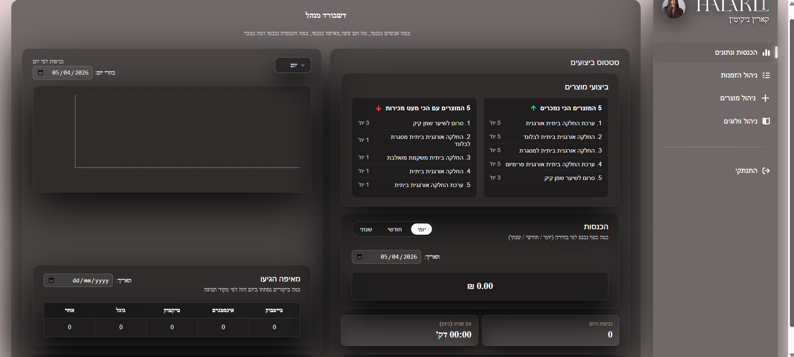
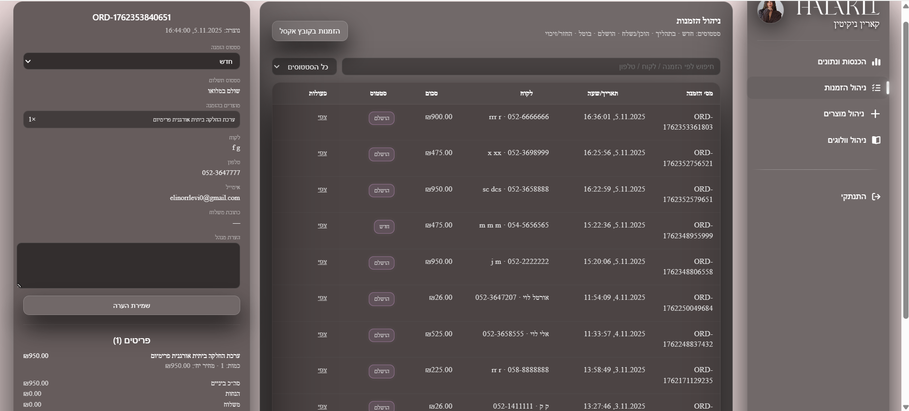
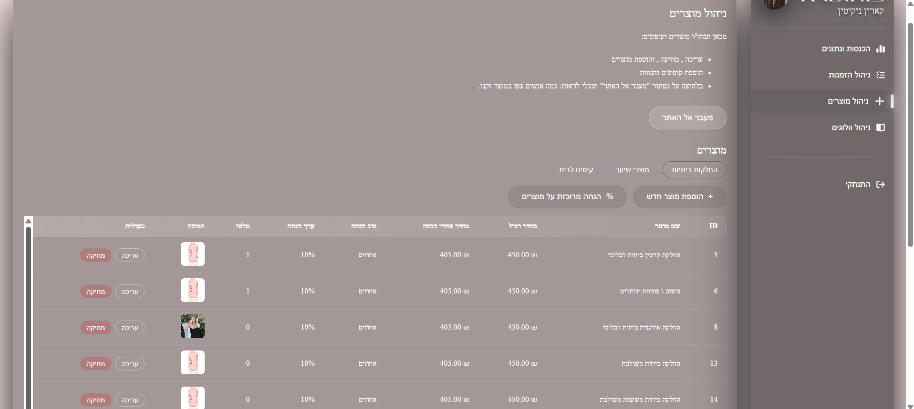
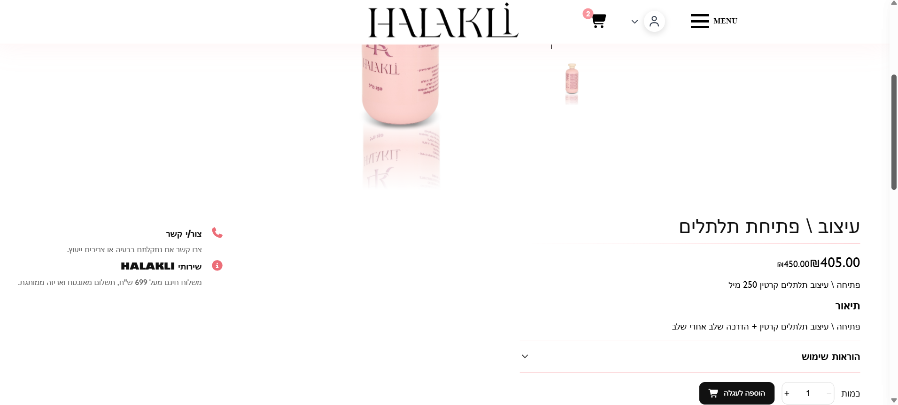
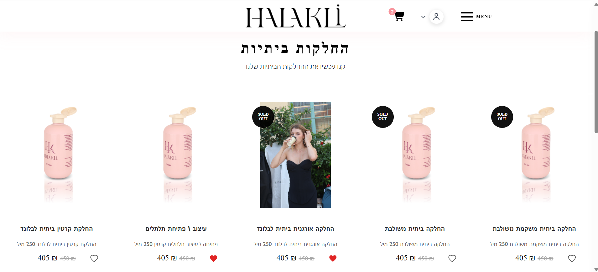
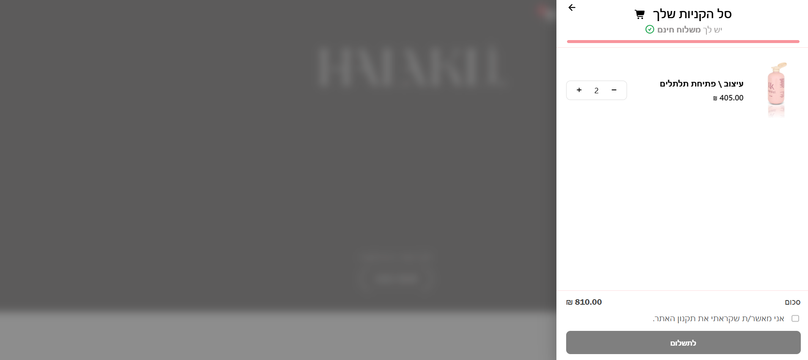

# Halakli – Hair Smoothing E-commerce Platform

## 📌 תיאור הפרויקט
פלטפורמת E-commerce מלאה למותג "חלקלי" בתחום החלקות שיער.  
המערכת כוללת חנות אונליין, אזור משתמשים, וממשק ניהול (Admin Dashboard) עם יכולות מתקדמות לניהול מוצרים, הזמנות, קופונים, תוכן ואנליטיקות.

הפרויקט מבוסס על אפיון מערכת אמיתית הכוללת חוויית משתמש מלאה – החל מדף בית עם תוכן דינמי ועד תהליך רכישה וניהול מערכת מצד המנהל.

---

## 🛠 טכנולוגיות

### Frontend:
- React.js
- JavaScript (ES6+)
- Context API
- CSS (Responsive + UX/UI)

### Backend:
- Node.js
- Express
- MySQL
- REST API

### נוספים:
- JWT Authentication
- bcrypt (הצפנת סיסמאות)
- LocalStorage
- Recharts (אנליטיקות)
- Tiptap Editor (ניהול תוכן)

---

## 🧠 ארכיטקטורה
- הפרדה בין Client / Server
- מבנה Controllers + Routes בצד השרת
- ניהול state גלובלי באמצעות Context
- Authentication עם JWT והרשאות (Admin / User)
- שימוש ב־Transactions לניהול הזמנות ותשלומים

---

## 🚀 פיצ'רים

### 🏠 דף בית
- הצגת קטגוריות (מוצרים, החלקות, קורסים)
- שילוב תמונות וסרטונים דינמיים

---

### 🛍 מוצרים
- קטגוריות מוצרים (החלקות, מוצרי שיער וכו')
- עמוד מוצר מפורט עם גלריית תמונות
- תמונות מתחלפות (Hover effect)
- מידע מלא: תיאור והוראות שימוש
- מוצרים קשורים

---

### ❤️ מועדפים וסל
- הוספה למועדפים
- הוספה לסל
- שמירת מוצרים

---

### 🛒 עגלה ותשלום
- עדכון כמויות
- הכנסת קופון
- תהליך Checkout מלא

---

### 💳 תשלומים
- ניהול סטטוסים (AUTHORIZED / CAPTURED / FAILED / REFUNDED)

---

### 🎟 קופונים
- הנחות באחוזים / סכום קבוע / משלוח חינם
- קופונים לפי קטגוריות

---

### 👤 משתמשים
- הרשמה והתחברות
- איפוס סיסמה (Forgot Password)
- אזור אישי:
  - רשימת משאלות
  - פרטים אישיים

---

### 📝 וולוגים / בלוג
- יצירת מאמרים
- עורך תוכן מתקדם
- לייקים וצפיות
- שיתוף ברשתות חברתיות

---

### 📊 Admin Dashboard
- צפייה בנתוני האתר:
  - כניסות
  - מקורות תנועה
  - הכנסות
- גרפים וסטטיסטיקות

---

### 📦 ניהול הזמנות
- צפייה בהזמנות
- שינוי סטטוסים (חדש / בתהליך / נשלח / הושלם / בוטל / החזר)
- פרטי לקוח ותשלום

---

### 🛠 ניהול מערכת
- CRUD למוצרים
- ניהול מלאי
- ניהול קופונים
- ניהול תוכן (בלוגים)
- העלאת תמונות

---
## 🎥 Demo Video

### 👤website
[Watch website Demo](https://youtu.be/T-k35AHmEco)

### 🛠 Admin and User Flow
[Watch Admin and User Demo](https://youtu.be/fbJgGWiHP_U)

---

## 📷 Screenshots

### 📊 Admin Dashboard


### 📦 Orders Management


### 🛍 Product Management


### Product page Page



## ▶️ איך מריצים

```bash
npm install
npm run start

---


### Products


### 🛒 Cart / Checkout


---
